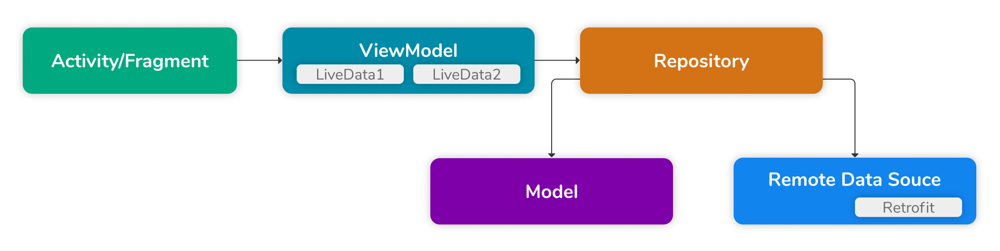
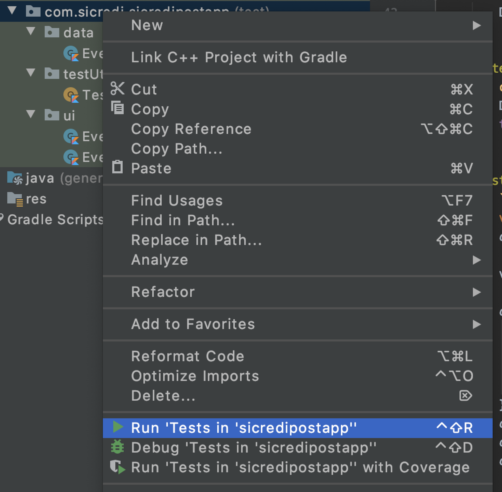

# Events Sicredi

[]()
[]()
[]()
[]()
[]()
[]()

## Descrição do Projeto

- O Events Sicredi é um APP criado para demonstação de algumas bibliotecas e implementações do Android.

<p align="center">
 <a href="#começando">Começando</a> •
 <a href="#features">Features</a> • 
 <a href="#arquitetura">Arquitetura</a> • 
 <a href="#testes">Testes</a> • 
 <a href="#tecnologias">Tecnologias</a> • 
 <a href="#preview">Preview</a>
</p>

## Começando

- Para executar o projeto, será necessário instalar o [Android Studio](https://developer.android.com/studio/install?hl=pt-br&authuser=1).
- E para iniciar o desenvolvimento, é necessário clonar o projeto do GitHub num diretório de sua preferência:

```shell
cd "diretorio de sua preferencia"
git clone https://github.com/ArthurLDS/events-android.git
```

## Features

- O APP apresenta uma lista de eventos.
- Também apresenta os detalhes de um evento específico, onde o usuário pode fazer o check in  e também compartilhar o evento com outras pessoas em outros aplicativos
- Implementação de injeção de dependências usando `Koin`
- Cobertura de testes unitários dos repositorios e das view models usando a biblioteca `Mockk`
- O Código foi escrito buscando manter as melhores práticas de Clean Code

## Arquitetura

- O aplicativo usa **MVVM** como arquitetura, conforme recomendação do próprio Google.


## Testes

- Para rodar os testes basta abrir o projeto no Android Studio.
- Logo em seguida navegue até a pasta `com.secredi.sicredipostapp`
- Clique com o botão direito sobre a pasta e depois em `Run 'Tests in 'sicredipostapp''`


## Tecnologias

As seguintes bibliotecas e frameworks foram usadas na construção do projeto:
- [Koin](https://github.com/InsertKoinIO/koin)
- [Glide](https://github.com/bumptech/glide)
- [Retrofit](https://github.com/square/retrofit)
- [Mockk](https://github.com/mockk/mockk)
- [AndroidX](https://developer.android.com/jetpack/androidx?authuser=1)

## Preview
 
